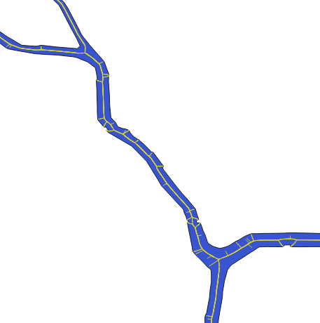

# centerline
 xxx_centerline.py scripts generate geojson centerlines for network-like polygons (e.g. polygon rivers and streets) with Python/scipy.spatial/OGR-shapely - based on the centerline script from python-geospatial-analysis-cookbook (https://github.com/mdiener21/python-geospatial-analysis-cookbook/tree/master/ch08/code) by Michael Diener. I haven't read the book but his scripts are available via GitHub - nice! The downloaded scripts were modified to make it work with my files.

### Output examples 

(would probably need cleaning but the output will make a good start):

[test_centerline.geojson](test_centerlines.geojson): test centerline extracted from [raster-base-shapefile](test.geojson) in WGS84.

rasterRivers_centerline.geojson: centerlines extracted from river networks shapefile which was based on satelite-imagery-base raster data (see rasterRivers.zip) in WGS84.

ChicagoRiver_centerline.geojson: centerline extracted from Chicago river network based on Hydro file from the Chicago Data Portal (see ChicagoRiver.zip). Note: the shapefile and geojson are projected (IL state plane NAD 1983 east in feet), not in WGS84.

### References:

python-geospatial-analysis-cookbook: https://github.com/mdiener21/python-geospatial-analysis-cookbook/tree/master/ch08/code

Fun GIF that gives an idea about the basic centerline creation process: https://commons.wikimedia.org/wiki/File:Voronoi_centerlines_skeleton.gif

Geojson specs: http://geojson.org/geojson-spec.html

This was helpful to me -: http://www.andrewdyck.com/how-to-convert-csv-data-to-geojson/
